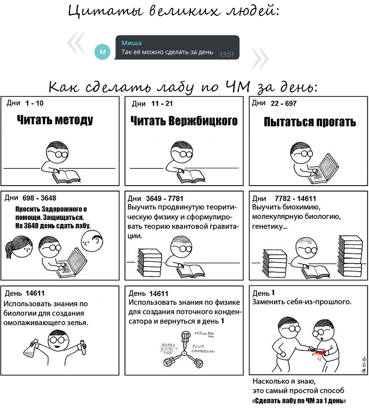
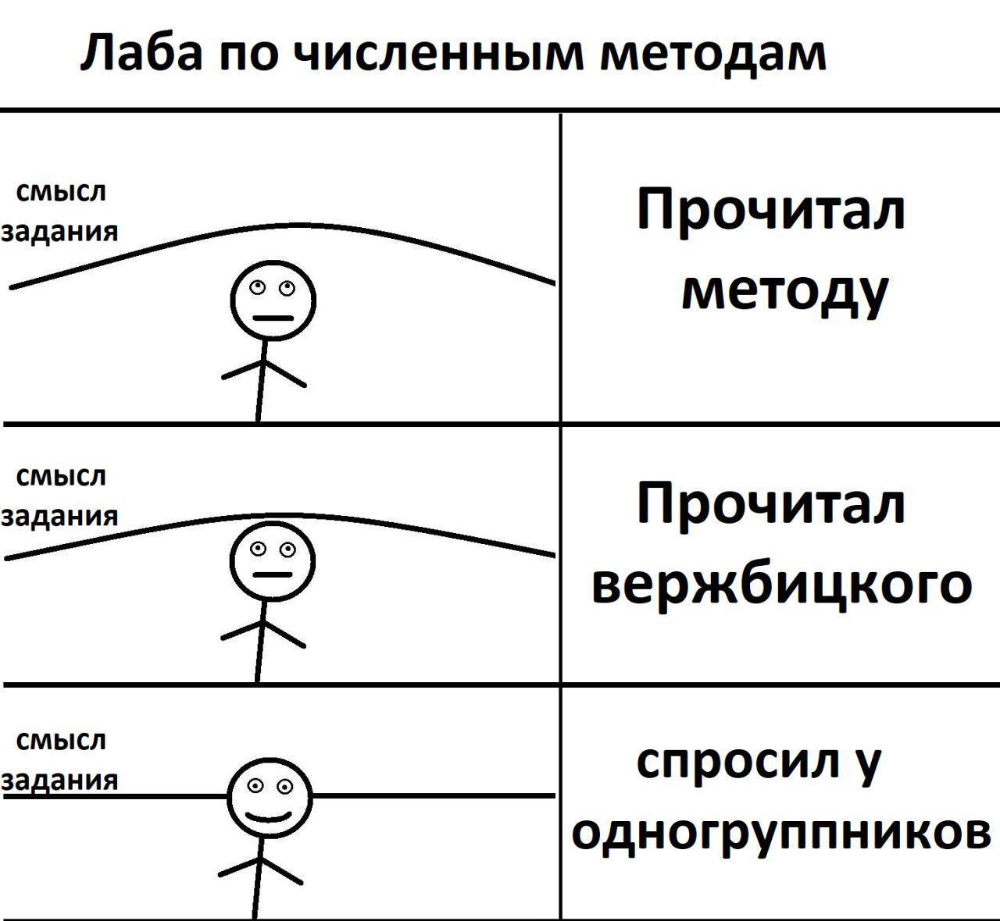

# Лабоработные работы по дисциплине "Численные методы" на факультет ФПМИ, НГТУ 

Папки:
1. Прямые методы решения СЛАУ. Разложение LDLT, хранение в профильном формате.
2. Итерационные методы решения СЛАУ. Метод Якоби и Гаусса-Зейделя для диагональных матриц. Формат диагональной матрицы - произвольный.
3. 
4. 

# Локальный мем 1

# Локальный мем 2

